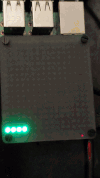

# Description
Derived from [Official Unicorn Python Library](https://github.com/pimoroni/unicorn-hat-hd).
I extracted how the call to [spidev.xfer2 call](https://github.com/pimoroni/unicorn-hat-hd/blob/586c295077950583b8a1d84141e87f30334b236d/library/unicornhathd/__init__.py#L279) was being built and remade it in Elixir. I included the python mock [here](/py_sandbox) if you want to see how I did it.


The only example so far can be found in `/unicorn_hadhd/examples/line_rotate/`. This was an Elixir re-creation of [line.py](https://github.com/pimoroni/unicorn-hat-hd/blob/master/examples/line.py).


I originally set out to incorporate the HatHD board functionality into [Greg Meffords Blinkchain](https://github.com/GregMefford/blinkchain). But the SPI was enough to confuse me into creating my own repo. And subsequently removing all of the interesting and impressive stuff from Gregs code.

## Usage

Out of box, this is configured for `eth0`. First configure `unicorn_hathd/examples/line_rotate/config/config.exs` according to [nerves-init-gadget](https://github.com/nerves-project/nerves_init_gadget).

#### line rotate
```
cd ./unicorn_hadhd/examples/line_rotate/
mix deps.get
mix firmware
mix firmware.burn
```

Pull it out. Stick it in to target device.
`ssh nerves.local` Or get into iex on host.

```
LineRotate.start_link
```
This should start what you see in gif.

#### Libs

The [UnicornHathd](unicorn_hathd/lib/unicorn_hathd.ex) module has base draw functions.

[UnicornHathd.Matrix](unicorn_hathd/lib/unicorn_hathd/matrix.ex) Does all the Matrix transforms.

[UnicornHathd.Display](unicorn_hathd/lib/unicorn_hathd/display.ex) Wraps the SPI functionality.